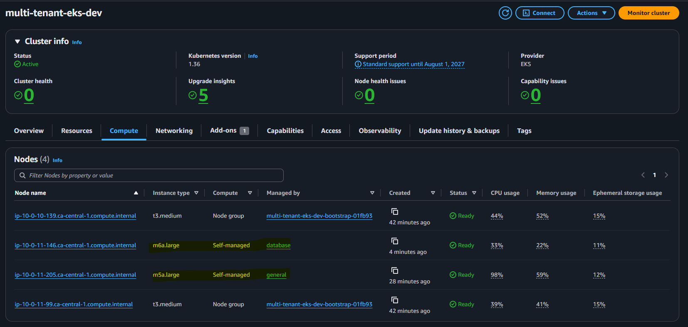
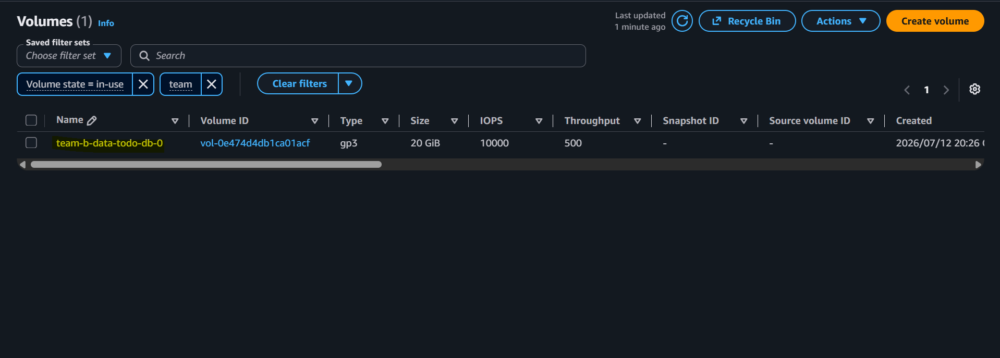
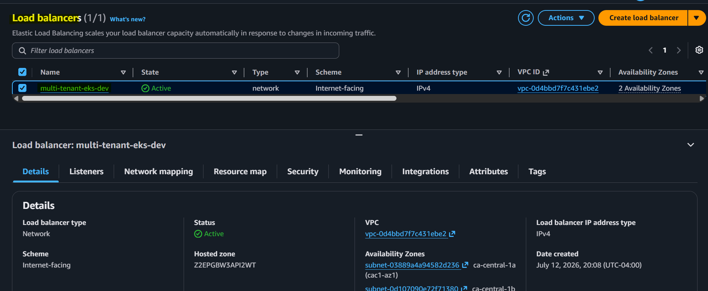
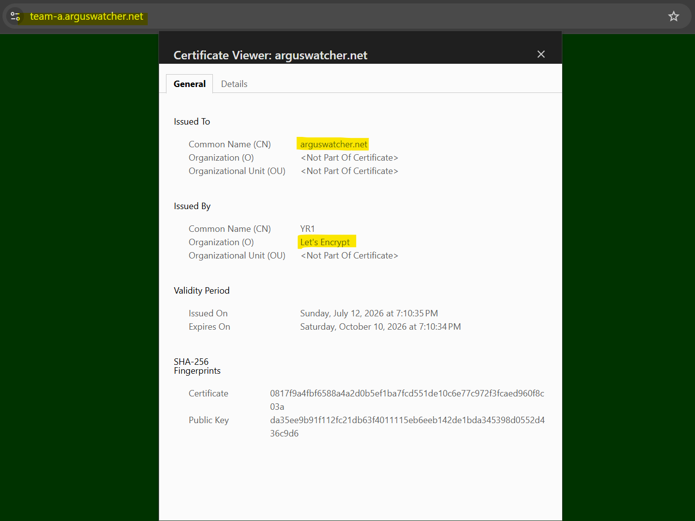

# Multi-tenant Platform Runbook - Capabilities

[Back](../README.md)

- [Multi-tenant Platform Runbook - Capabilities](#multi-tenant-platform-runbook---capabilities)
  - [Compute](#compute)
  - [Storage](#storage)
  - [Networking](#networking)
  - [Security](#security)

---

## Compute

```sh
kubectl get nodepool
# NAME       NODECLASS   NODES   READY   AGE
# database   database    0       True    17m
# general    general     1       True    17m
# gpu        gpu         0       True    17m

kubectl get ec2nodeclass
# NAME       READY   AGE
# database   True    17m
# general    True    17m
# gpu        True    17m

kubectl get nodeclaim
# NAME             TYPE        CAPACITY    ZONE            NODE                                           READY   AGE
# database-2876g   m6a.large   on-demand   ca-central-1b   ip-10-0-11-146.ca-central-1.compute.internal   True    4m16s
# general-jdtxw    m5a.large   on-demand   ca-central-1b   ip-10-0-11-205.ca-central-1.compute.internal   True    27m

kubectl get nodes -L workload-class,karpenter.sh/nodepool,node.kubernetes.io/instance-type
# NAME                                           STATUS   ROLES    AGE     VERSION               WORKLOAD-CLASS   NODEPOOL   INSTANCE-TYPE
# ip-10-0-10-139.ca-central-1.compute.internal   Ready    <none>   44m     v1.36.2-eks-8f14419   platform                    t3.medium
# ip-10-0-11-146.ca-central-1.compute.internal   Ready    <none>   6m50s   v1.36.2-eks-8f14419   database         database   m6a.large
# ip-10-0-11-205.ca-central-1.compute.internal   Ready    <none>   30m     v1.36.2-eks-8f14419   general          general    m5a.large
# ip-10-0-11-99.ca-central-1.compute.internal    Ready    <none>   44m     v1.36.2-eks-8f14419   platform                    t3.medium
```




---

## Storage

```sh
kubectl get storageclass
# NAME            PROVISIONER             RECLAIMPOLICY   VOLUMEBINDINGMODE      ALLOWVOLUMEEXPANSION   AGE
# gp2             kubernetes.io/aws-ebs   Delete          WaitForFirstConsumer   false                  35m
# gp3 (default)   ebs.csi.aws.com         Delete          WaitForFirstConsumer   true                   19m
# gp3-iops        ebs.csi.aws.com         Retain          WaitForFirstConsumer   true                   19m

kubectl get pv -A
# NAME                                       CAPACITY   ACCESS MODES   RECLAIM POLICY   STATUS   CLAIM                   STORAGECLASS   VOLUMEATTRIBUTESCLASS   REASON   AGE
# pvc-d8b52f35-d5a3-4f65-8419-ab196c095131   20Gi       RWO            Retain           Bound    team-b/data-todo-db-0   gp3-iops       <unset>                          7m28s

kubectl get pvc -A
# NAMESPACE   NAME             STATUS   VOLUME                                     CAPACITY   ACCESS MODES   STORAGECLASS   VOLUMEATTRIBUTESCLASS   AGE
# team-b      data-todo-db-0   Bound    pvc-d8b52f35-d5a3-4f65-8419-ab196c095131   20Gi       RWO            gp3-iops       <unset>                 8m40s
```




---

## Networking

```sh
kubectl get gateway -A
# NAMESPACE       NAME            CLASS   ADDRESS                                                                PROGRAMMED   AGE
# istio-ingress   istio-ingress   istio   multi-tenant-eks-dev-1d7dce920110640c.elb.ca-central-1.amazonaws.com   True         30m

kubectl get httproute -A
# NAMESPACE   NAME       HOSTNAMES                     AGE
# team-a      web        ["team-a.arguswatcher.net"]   13m
# team-b      todo-api   ["team-b.arguswatcher.net"]   13m
# team-b      todo-web   ["team-b.arguswatcher.net"]   13m

kubectl get certificate -A
# NAMESPACE       NAME                        READY   SECRET                          AGE
# istio-ingress   arguswatcher-net-wildcard   True    arguswatcher-net-wildcard-tls   31m

kubectl get order -A
# NAMESPACE       NAME                                     STATE   AGE
# istio-ingress   arguswatcher-net-wildcard-1-3889745998   valid   32m

```




---

## Security

```sh
# eso
kubectl get clustersecretstore
# NAME                 AGE   STATUS   CAPABILITIES   READY
# aws-secretsmanager   40m   Valid    ReadWrite      True

kubectl get externalsecret -A
# NAMESPACE      NAME                   STORETYPE            STORE                REFRESH INTERVAL   STATUS         READY   LAST SYNC
# cert-manager   cloudflare-api-token   ClusterSecretStore   aws-secretsmanager   1h                 SecretSynced   True    40m
# external-dns   cloudflare-api-token   ClusterSecretStore   aws-secretsmanager   1h                 SecretSynced   True    40m

# kyverno policy
kubectl get clusterpolicy
# NAME                                ADMISSION   BACKGROUND   READY   AGE   MESSAGE
# disallow-host-namespace             true        true         True    41m   Ready
# disallow-latest-tag                 true        true         True    41m   Ready
# disallow-privileged                 true        true         True    41m   Ready
# httproute-hostname-scoped-to-team   true        true         True    41m   Ready
# require-probes                      true        true         True    41m   Ready
# require-requests                    true        true         True    41m   Ready
# require-runbook-annotation          true        true         True    41m   Ready
# require-team-label                  true        true         True    41m   Ready
# restrict-image-registries           true        true         True    41m   Ready

# resource quota
kubectl get resourcequota -A
# NAMESPACE   NAME           REQUEST                                                                          LIMIT                                             AGE
# team-a      tenant-quota   persistentvolumeclaims: 0/10, requests.cpu: 100m/4, requests.memory: 128Mi/8Gi   limits.cpu: 200m/8, limits.memory: 256Mi/16Gi     19m
# team-b      tenant-quota   persistentvolumeclaims: 1/10, requests.cpu: 300m/4, requests.memory: 640Mi/8Gi   limits.cpu: 1500m/8, limits.memory: 1280Mi/16Gi   19m

# limitrange
kubectl get limitrange -A
# NAMESPACE   NAME            CREATED AT
# team-a      tenant-limits   2026-07-13T00:25:42Z
# team-b      tenant-limits   2026-07-13T00:25:43Z
```


